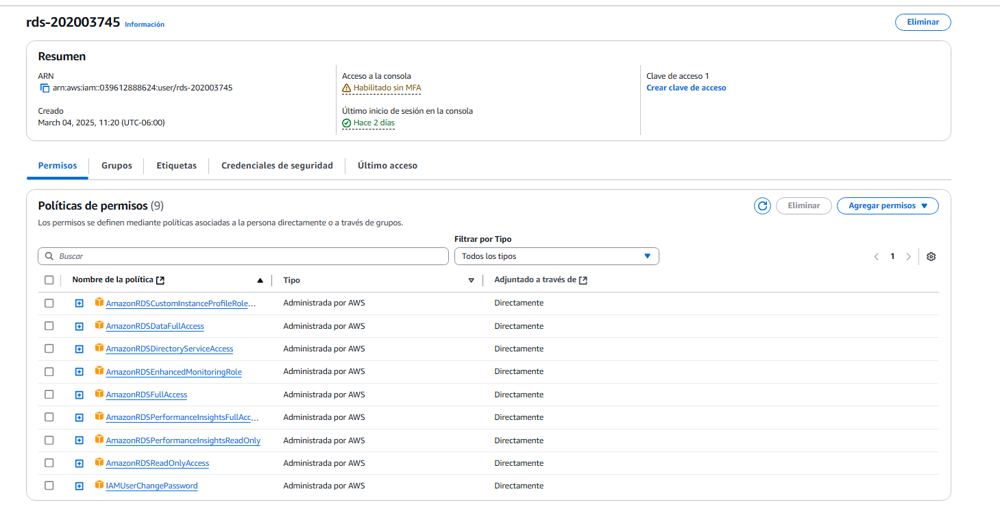
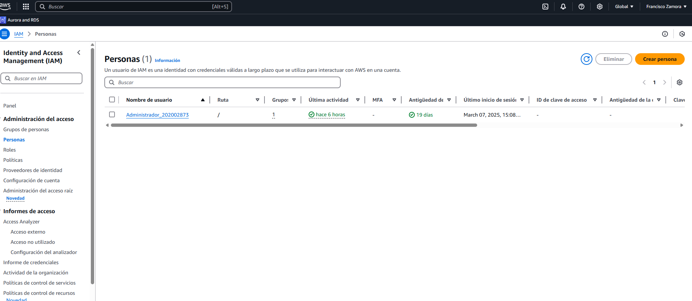
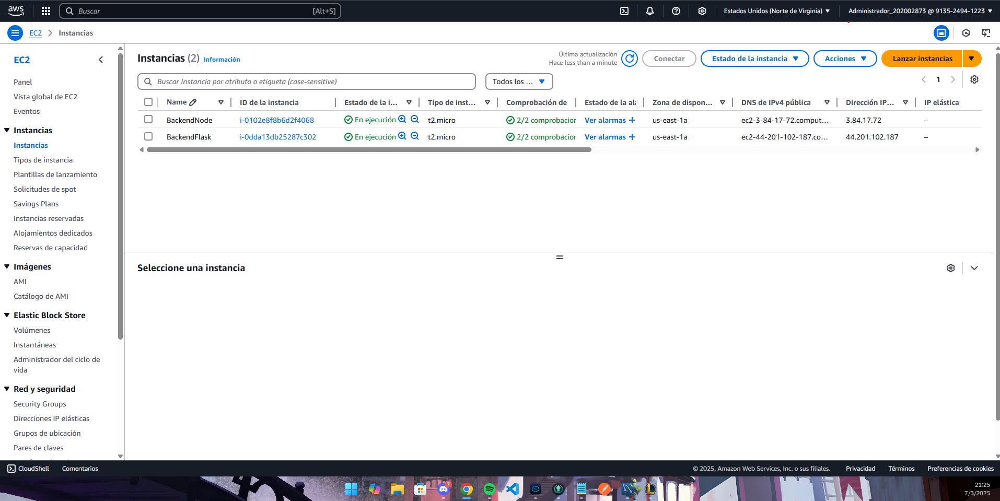
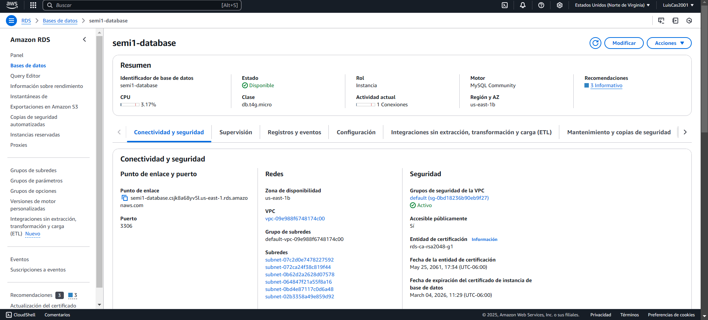

# Manual técnico Seminario de Sistemas 1

## Objetivo del manual

Este manual tiene como propósito explicar de manera clara y sencilla cómo funciona *EbookVault* y cómo se implementa en la nube con los servicios de AWS. La idea es que cualquier persona que trabaje en el desarrollo o mantenimiento de la plataforma tenga una guía para entender desde la arquitectura del sistema hasta la configuración de cada servicio en la nube.

En este documento, se detallará cómo *EbookVault* aprovecha AWS para alojar su sitio web en *S3*, gestionar servidores en *EC2*, manejar la base de datos con *RDS*, distribuir el tráfico con un *Load Balancer* y almacenar los archivos de los libros e imágenes. También se explicará el uso de *IAM* para la seguridad y control de accesos, así como la encriptación de datos sensibles.

## Arquitectura del proyecto

El proyecto se base en 4 componentes fundamentales de AWS

- S3

- IAM

- RDS

- EC2

- Load Balancer

A continuación se explicará de forma detallada que hace cada uno de estos y su función en el proyecto.

## Amazon S3

**Amazon S3 (Simple Storage Service)** es un servicio de almacenamiento en la nube de AWS diseñado para almacenar y recuperar grandes volúmenes de datos de manera segura, escalable y altamente disponible. Es ideal para guardar archivos estáticos como imágenes, documentos, videos y más.

En el proyecto *EbookVault*, **Amazon S3 tendrá dos funciones clave**:

1. **Alojamiento del sitio web estático**
   
   - El frontend de *EbookVault* estará alojado en un **bucket de S3** configurado para servir contenido como un sitio web estático.
   - Esto permitirá que los usuarios accedan a la plataforma de manera rápida y eficiente desde cualquier dispositivo.
   - El bucket se llamará **ebookvault-semi1-A-g#**.

2. **Almacenamiento de archivos de libros e imágenes**
   
   - Se usará otro **bucket de S3** para guardar todos los archivos PDF de los libros y las imágenes de portada.
   - Se organizarán en dos carpetas dentro del bucket:
     - **Fotos** → Para las imágenes de portada de los libros.
     - **Libros** → Para los archivos PDF de los libros adquiridos por los usuarios.
   - Este bucket se llamará **archivos-semi1-A-g#** y tendrá configuraciones públicas controladas para permitir que la aplicación acceda a estos archivos.

## Amazon EC2

**Amazon EC2 (Elastic Compute Cloud)** es un servicio de AWS que proporciona servidores virtuales en la nube. Permite ejecutar aplicaciones con flexibilidad, escalabilidad y control total sobre el entorno del servidor.

En *EbookVault*, **Amazon EC2 tendrá un papel fundamental** en el backend del sistema, ya que alojará los servidores que manejarán la lógica de negocio, la autenticación de usuarios y la comunicación con la base de datos.

#### **Funciones de EC2 en EbookVault:**

1. **Ejecución de los servidores backend**
   
   - Se configurarán **dos instancias de EC2** con el mismo backend para garantizar disponibilidad y distribuir la carga de tráfico.
   - Estas instancias manejarán la autenticación, la gestión de libros y las peticiones de los usuarios.
   - Se utilizarán **Node.js y Python** como lenguajes principales en estos servidores.

2. **Integración con el Balanceador de Carga (Load Balancer)**
   
   - Las instancias de EC2 estarán conectadas a un **Load Balancer** que distribuirá el tráfico entre ambas.
   - Esto ayudará a mejorar el rendimiento y evitará que un solo servidor se sobrecargue.

3. **Configuración de Seguridad**
   
   - Se habilitarán solo los puertos necesarios en los **Security Groups** para limitar el acceso externo y mejorar la seguridad.
   - Se establecerán reglas de acceso específicas para la comunicación con la base de datos y otros servicios de AWS.

4. **Escalabilidad**
   
   - En el futuro, si *EbookVault* necesita manejar más tráfico, se pueden agregar más instancias de EC2 de forma automática para adaptarse a la demanda.

## Amazon RDS

**Amazon RDS (Relational Database Service)** es un servicio administrado de bases de datos en la nube que facilita la configuración, operación y escalabilidad de bases de datos relacionales. AWS se encarga del mantenimiento, copias de seguridad y seguridad, permitiendo que los desarrolladores se enfoquen en la aplicación sin preocuparse por la infraestructura.

#### **Funciones de RDS en *EbookVault***

1. **Base de datos MySQL para almacenar información**
   
   - En *EbookVault*, utilizaremos **MySQL** como motor de base de datos en **Amazon RDS**.
   - Se almacenará información como:
     - **Usuarios** (nombres, correos, contraseñas encriptadas, etc.).
     - **Libros** (nombre, autor, sinopsis, portada, etc.).
     - **Relaciones entre usuarios y libros adquiridos**.

2. **Encriptación de contraseñas y seguridad**
   
   - Todas las contraseñas se almacenarán **encriptadas** usando una librería de seguridad.
   - En lugar de guardar archivos PDF o imágenes dentro de la base de datos, se almacenarán solo **las URLs de los archivos en S3**, optimizando el rendimiento.

3. **Alta disponibilidad y escalabilidad**
   
   - RDS con MySQL permitirá habilitar **replicación automática** y recuperación ante fallos, asegurando que la base de datos esté siempre disponible.
   - Se podrá **escalar vertical u horizontalmente** según la cantidad de usuarios y libros que maneje la plataforma.

4. **Compatibilidad y optimización**
   
   - MySQL es una opción robusta y optimizada para consultas rápidas, lo que garantizará un buen desempeño en *EbookVault*.
   - Se podrán utilizar **índices y optimizaciones de consultas** para mejorar la velocidad de acceso a los datos.

## Funciones de load Balancer

**AWS Load Balancer (Balanceador de Carga)** es un servicio que distribuye automáticamente el tráfico entre múltiples instancias de servidores para mejorar la disponibilidad, estabilidad y escalabilidad de una aplicación.

En *EbookVault*, el **Load Balancer** tendrá un papel clave en la infraestructura, ya que permitirá que los usuarios accedan a la plataforma sin preocuparse por qué servidor está atendiendo la solicitud.

---

### **Funciones del Load Balancer en *EbookVault***

1. **Distribución del tráfico entre los servidores de EC2**
   
   - Se tendrán **dos instancias de EC2** ejecutando el backend de la aplicación.
   - El **Load Balancer** se encargará de repartir las solicitudes entre ambas instancias para optimizar el rendimiento.
   - Si una instancia falla, el tráfico se redirigirá automáticamente a la otra disponible.

2. **Alta disponibilidad y tolerancia a fallos**
   
   - Si una instancia EC2 deja de responder, el Load Balancer la detectará y **dejará de enviarle tráfico**.
   - Una vez que la instancia vuelva a estar operativa, el tráfico se distribuirá de nuevo de manera equitativa.

3. **Seguridad y manejo de certificados SSL**
   
   - Se podrá configurar el **Load Balancer con un certificado SSL**, asegurando que todas las conexiones sean seguras mediante HTTPS.
   - También se pueden establecer **reglas de seguridad** para evitar accesos no autorizados.

4. **Optimización del rendimiento**
   
   - Reduce la carga en cada servidor individual, evitando cuellos de botella.
   - Permite escalar horizontalmente agregando más instancias EC2 si la demanda de usuarios aumenta.

5. **Único punto de acceso para los usuarios**
   
   - Los usuarios finales solo interactúan con el Load Balancer, sin necesidad de conocer las direcciones IP de los servidores EC2.
   - Esto hace que la arquitectura sea más flexible y fácil de administrar.

## Diagrama entidad relación

## Usuario de IAM con sus políticas asociadas

### Usuario de RDS

Para el usuario de rds, como se observa en la imagen se le asignaron los permisos necesarios para poder realizar un manejo completo del servicio de RDS.

Debido a que rds solo fue manejada por una persona, no se crearon grupos ni roles, solo se le asignaron las políticas necesarias para que este usuario solo pueda realizar acciones de rds.

### Usuario de EC2

Para el usuario de ec2, se asignaron todos los permisos para trabajar con las maquinas virtuales.

## Usuarios de S3

Para estos usuarios se utilizo para tener permiso de acceder a los bucket de S3 de imagenes y archivos

### S3 Frontend

## Servicios utilizados y sus configuraciones

### EC2 y load balancer

Se usaron 2 maquinas virtuales con ubuntu para correr los 2 tipos de backend solicitados y se creo el load balancer para las 2 maquinas

### RDS

Se uso una base de datos en mysql, y además se dio un acceso público para que cualquier usuario pueda acceder a esta base de datos.

## S3

## S3 frontend

## Conclusiones

- **Escalabilidad y Flexibilidad**  
  Usar servicios de AWS como **EC2**, **RDS**, **S3** y **Load Balancer** nos da la capacidad de **escalar la aplicación** sin preocuparnos demasiado por la infraestructura. Esto significa que, a medida que *EbookVault* crezca y más personas usen la plataforma, podremos añadir recursos fácilmente sin problemas. 

- **Seguridad Ante Todo**  
  Implementar **IAM** para gestionar los permisos y roles es crucial para mantener la seguridad. Desde el manejo de usuario hasta el control de acceso a los archivos, todo está diseñado para que los datos de los usuarios estén protegidos y solo las personas autorizadas tengan acceso a lo que necesitan.

- **Simplicidad en la Gestión**  
  Con el **Load Balancer**, no tenemos que preocuparnos por qué servidor está manejando el tráfico, ya que todo se distribuye automáticamente. Si un servidor falla, el tráfico se redirige a otro sin que los usuarios se den cuenta.

- **Optimización de Recursos**  
  Usar **S3** para almacenar libros e imágenes permite ahorrar espacio en la base de datos y mejorar el rendimiento. Además, al tener todo en la nube, no tenemos que estar gestionando servidores físicos, lo que nos ahorra tiempo y dinero.

- **Experiencia de Usuario Fluida**  
  Con la combinación de servidores bien distribuidos, bases de datos rápidas y recursos en la nube, *EbookVault* ofrece una experiencia de usuario rápida y sin interrupciones. Ya sea que estés buscando un libro, comprándolo o leyéndolo, todo estará accesible de manera eficiente
