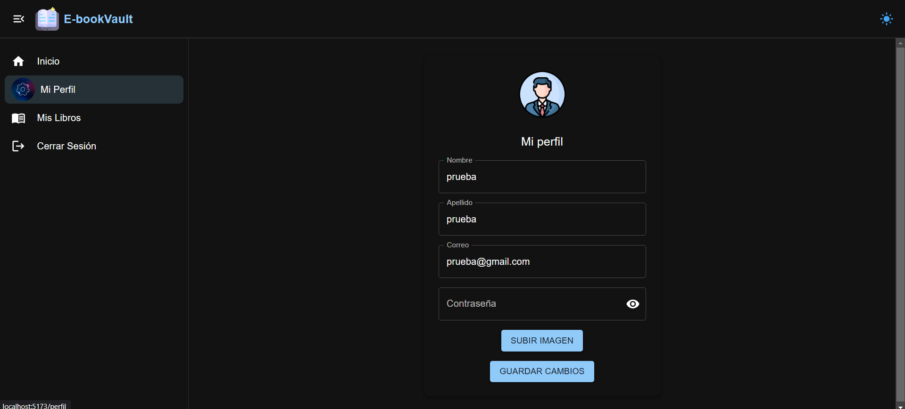

# Manual de usuario Seminario de Sistemas 1

## 

Este manual tiene como propósito explicar de manera clara y sencilla cómo funciona *EbookVault* y cómo se implementa en la nube con los servicios de AWS. La idea es que cualquier persona que trabaje en el desarrollo o mantenimiento de la plataforma tenga una guía para entender desde la arquitectura del sistema hasta la configuración de cada servicio en la nube.

## Guía del proyecto

### Login

El usuario podrá logearse para poder acceder a ebook

### Registrarse

Si el usuario no tiene cuenta, podrá crear una nueva, en la cual se le pedirán los siguientes atributos

### Inicio

Una vez el usuario se haya registrado, podrá ver los libros que estan disponible en ebook 

Al presionar el libro, al usuario le saldrán más especificaciones y si desea adquirir el libro.

### Mi perfil

También el usuario podrá ver su perfil y así mismo lo podrá editar

### Mis libros

El usuario podrá ver los libros que ha adquirido hasta el momento

# Vista de administrador

El administrador tendrá las mismas funciones que el usuario, con la diferencia que este puede añadir libros y actualizar la información de estos mismos.

### Agregar libro

Para agregar un libro, al administrador se le pedirá lo siguiente

### Actualizar libro

El administrador podrá editar los libros de la siguiente manera

Una vez haya completado los campos podrá realizar la actualización

### Eliminar libros

El administrador también puede eliminar los libros dando click en el botón de eliminar del libro.

Gracias por leer el manual =).
